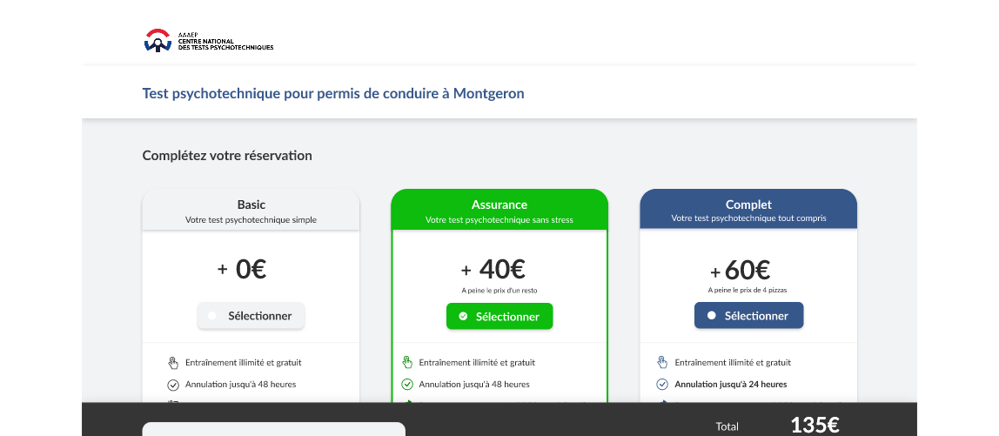
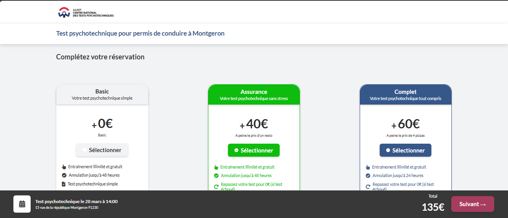
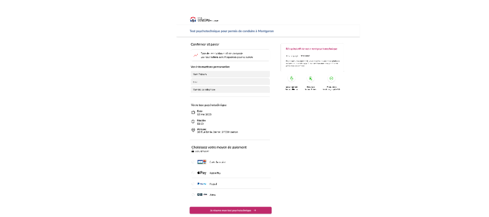
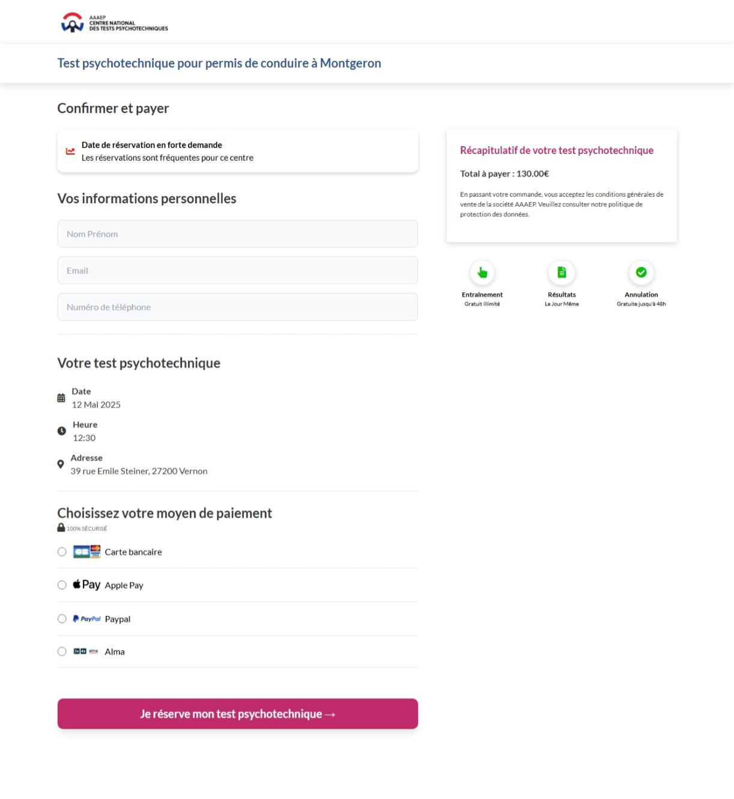

# 🚀 rec-0925-devfront - Test Technique Front-End

> **Projet de développement front-end** - Reproduction fidèle d'une interface utilisateur basée sur des maquettes Adobe XD pour un système de réservation de tests psychotechniques.

[](https://laravel.com)
[](https://tailwindcss.com)
[](https://php.net)
[](LICENSE)

## 📋 Table des Matières

-   [Vue d'ensemble](#vue-densemble)
-   [Prérequis](#prérequis)
-   [Installation](#installation)
-   [Configuration](#configuration)
-   [Démarrage](#démarrage)
-   [Utilisation](#utilisation)
-   [Structure du Projet](#structure-du-projet)
-   [Technologies](#technologies)
-   [Dépannage](#dépannage)
-   [État du Projet](#état-du-projet)

## 🎯 Vue d'ensemble

Ce projet constitue un **test technique de développement front-end** visant à reproduire pixel-perfect une interface utilisateur conçue dans Adobe XD. Il comprend deux pages principales pour la gestion des réservations de tests psychotechniques pour permis de conduire.

### ✨ Fonctionnalités Principales

-   **Page de Réservation** : Sélection de packages (Basic, Assurance, Complet)
-   **Page de Paiement** : Formulaire de paiement et confirmation
-   **Interface Responsive** : Optimisée pour desktop et mobile
-   **Design System** : Utilisation de Tailwind CSS et composants cohérents

## 📋 Prérequis

Avant de commencer, assurez-vous d'avoir installé :

| Logiciel     | Version | Description                        |
| ------------ | ------- | ---------------------------------- |
| **XAMPP**    | Latest  | Serveur local (Apache, MySQL, PHP) |
| **PHP**      | 8.1+    | Inclus dans XAMPP                  |
| **Composer** | Latest  | Gestionnaire de dépendances PHP    |
| **Node.js**  | 16+     | Runtime JavaScript                 |
| **npm**      | Latest  | Gestionnaire de packages Node.js   |
| **Git**      | Latest  | Contrôle de version                |

### 🔧 Configuration Requise

-   **Extension PHP Zip** : Activée dans `php.ini`
-   **Navigateur moderne** : Chrome, Firefox, Safari, Edge

## 📦 Installation

### 1. Clonage du Dépôt

```bash
# Clonez le projet
git clone https://github.com/Deste-Mo/rec-0925-devfront.git

# Accédez au répertoire
cd rec-0925-devfront
```

### 2. Téléchargement Alternatif

1. Rendez-vous sur [GitHub](https://github.com/Deste-Mo/rec-0925-devfront)
2. Cliquez sur **"Code"** → **"Download ZIP"**
3. Extrayez l'archive dans votre répertoire de travail

## ⚙️ Configuration

### Configuration de XAMPP

#### 1. Extension PHP Zip

```bash
# Ouvrez php.ini
notepad C:\xampp\php\php.ini

# Recherchez et décommentez :
extension=zip

# Redémarrez XAMPP
```

#### 2. Installation de Composer

```bash
# Téléchargez Composer
powershell -Command "Invoke-WebRequest -Uri 'https://getcomposer.org/composer.phar' -OutFile 'C:\xampp\composer.phar'"

# Vérifiez l'installation
C:\xampp\php\php.exe C:\xampp\composer.phar --version
```

### Installation des Dépendances

#### 3. Dépendances PHP (Composer)

```bash
# Installez les dépendances
C:\xampp\php\php.exe C:\xampp\composer.phar install --no-dev

# Vérifiez l'installation
C:\xampp\php\php.exe artisan --version
```

#### 4. Dépendances Node.js

```bash
# Installez les packages
npm install

# Vérifiez l'installation
npm --version
```

#### 5. Configuration Laravel

```bash
# Copiez le fichier d'environnement
copy .env.example .env

# Générez la clé d'application
C:\xampp\php\php.exe artisan key:generate
```

## 🚀 Démarrage

### Démarrage Rapide

```bash
# Terminal 1 : Serveur Laravel
C:\xampp\php\php.exe artisan serve --host=127.0.0.1 --port=8000

# Terminal 2 : Assets Vite (optionnel)
npm run dev
```

### Accès à l'Application

Une fois démarré, accédez à l'application via :

| Page               | URL                                                              | Description            |
| ------------------ | ---------------------------------------------------------------- | ---------------------- |
| 🏠 **Accueil**     | `http://127.0.0.1:8000/`                                         | Page d'accueil Laravel |
| 📝 **Réservation** | `http://127.0.0.1:8000/tolojanahary-completez-votre-reservation` | Sélection de package   |
| 💳 **Paiement**    | `http://127.0.0.1:8000/tolojanahary-paiement`                    | Formulaire de paiement |

## 📱 Utilisation

### Page de Réservation

**URL** : `/tolojanahary-completez-votre-reservation`

**Fonctionnalités** :

-   ✅ Sélection de packages (Basic, Assurance, Complet)
-   💰 Affichage des tarifs (0€, 40€, 60€)
-   📋 Description des avantages par package
-   🎨 Interface responsive avec états visuels

**Maquette**


**Design**


### Page de Paiement

**URL** : `/tolojanahary-paiement`

**Fonctionnalités** :

-   👤 Formulaire d'informations personnelles
-   📅 Récapitulatif du test (date, heure, lieu)
-   💳 Options de paiement multiples

**Fonctionnalités à implementer**

-   Boutton de Je réserve mon test psychotechnique
-   Style de Récapitulatif de test psychotechnique

**Maquette**


**Design**


## 🛠️ Technologies Utilisées

| Technologie                                                | Version | Usage                   |
| ---------------------------------------------------------- | ------- | ----------------------- |
|     | 10.x    | Framework PHP & Routage |
|        | 8.1+    | Backend                 |
|       | 4.x     | Build Tool              |
|  | Latest  | Environnement local     |

### Librairies & Outils

-   **Font Awesome** : Icônes vectorielles
-   **Google Fonts (Lato)** : Typographie
-   **Composer** : Gestionnaire de dépendances PHP
-   **npm** : Gestionnaire de packages Node.js

## 🔧 Notes Techniques

### ✅ Caractéristiques

-   📱 **Responsive Design** : Optimisé pour mobile et desktop
-   🎨 **Pixel Perfect** : Reproduction fidèle tolojanahary-completez-votre-reservation
-   🚀 **Performance** : Chargement optimisé avec tailwind
-   🔒 **Sécurité** : Routes Laravel sécurisées

### 📝 Conventions

-   **URLs personnalisées** : Format `{nom-de-famille}-{slug-de-la-page}`
-   **Architecture** : MVC avec Laravel
-   **Assets** : Gestion via Vite

## 🔧 Dépannage

### Problèmes Courants

| ❌ Problème                      | ✅ Solution                                                                  |
| -------------------------------- | ---------------------------------------------------------------------------- |
| **Extension zip manquante**      | Activez `extension=zip` dans `C:\xampp\php\php.ini`                          |
| **Composer introuvable**         | Téléchargez `composer.phar` dans `C:\xampp\`                                 |
| **vendor/autoload.php manquant** | Réinstallez : `C:\xampp\php\php.exe C:\xampp\composer.phar install --no-dev` |
| **Styles non chargés**           | Vérifiez la connexion internet (Tailwind CDN)                                |
| **Erreur 404 Laravel**           | Vérifiez les dépendances et la clé d'application                             |
| **Port 8000 occupé**             | Changez de port : `artisan serve --port=8001`                                |
| **Node.js manquant**             | Installez Node.js depuis [nodejs.org](https://nodejs.org)                    |

### Commandes de Diagnostic

```bash
# Vérifier PHP
C:\xampp\php\php.exe --version

# Vérifier Composer
C:\xampp\php\php.exe C:\xampp\composer.phar --version

# Vérifier Node.js
node --version && npm --version

# Vérifier Laravel
C:\xampp\php\php.exe artisan --version
```

## 📊 État du Projet

### ✅ Statut : **OPÉRATIONNEL**

| Composant    | Statut         | Détails                     |
| ------------ | -------------- | --------------------------- |
| **XAMPP**    | ✅ Configuré   | Extension zip activée       |
| **Composer** | ✅ Installé    | Dépendances PHP OK          |
| **Node.js**  | ✅ Installé    | Packages npm OK             |
| **Laravel**  | ✅ Configuré   | Clé générée, routes actives |
| **Serveur**  | ✅ Fonctionnel | Port 8000 actif             |
| **Pages**    | ✅ Accessibles | URLs personnalisées OK      |

### 📈 Métriques du Projet

-   **Lignes de code** : ~500+ lignes HTML/CSS
-   **Composants** : 2 pages principales + interface responsive
-   **Temps de développement** : 16 heures
-   **Technologies** : 8 technologies intégrées

## 📞 Support

Pour toute question ou assistance :

-   📧 **Email** : [modestep20.aps1a@gmail.com](mailto:modestep20.aps1a@gmail.com)
-   📱 **Issues** : [GitHub Issues](https://github.com/Deste-Mo/rec-0925-devfront/issues)
-   📖 **Documentation** : Ce README

---

<div align="center">

**🎉 Projet rec-0925-devfront - Test technique réussi !**

_Développé avec ❤️ par modeste_

</div>
